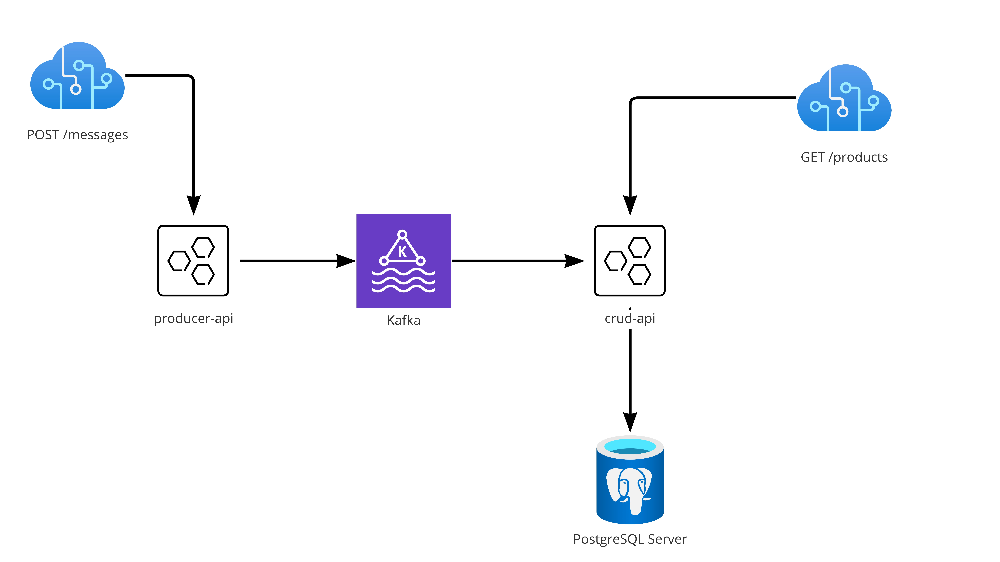

# Dockerized Spring Boot Apps with Kafka

#### In this example you are going to see how to run Spring Boot Apps consuming and publishing messages in Kafka.
Everything is dockerized and running in a docker-compose.yaml

## Pré Requisitos

- Java 17
- Docker
- Docker Compose

## Arquitetura



## Executando

`docker-compose up --build`

## Endpoints
### Enviando mensagem para o kafka
```
curl -X POST \
http://localhost:8081/message \
-H 'Accept: application/json' \
-H 'Content-Type: application/json' \
-d '{"name": "Tenis Nike Vapor max"}'

```

### Validando que o consumidor recebeu a mensagem e salvou no banco de dados
`curl localhost:8080/crud/products`
